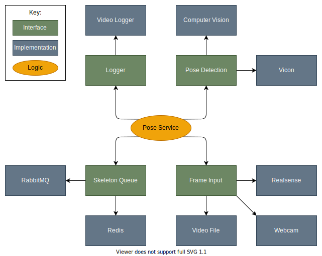

# Project Layout
## Modules

The following are main modules that comprise the project. Each can be found in a seperate folder.

* activities - Configuration files for setting up an activity (or "mode" of the program, if you will)
* constants 
* data_logging - Different kinds of data loggers for collecting information during an activity
* feedback - Modules used to deliver feedback to a user
* frame_input - Inputs in the form of RGB video frames 
* pose_detection - Methods of getting a user's pose and creating a skeleton of points
* skeleton_queue - Storing and sending a user's skeleton points for use elsewhere
* ui - Frontend frameworks and reusable components for user interaction
* utils - Commonly needed functions across all programs

## Project Architecture
The project is laid out in a [hexagonal architecture](https://en.wikipedia.org/wiki/Hexagonal_architecture_(software)) in an attempt to achieve the lowest amount of [coupling](https://en.wikipedia.org/wiki/Coupling_%28computer_programming%29) possible. This allows frame inputs, pose detection algorithms, and frontends to be swapped seamlessly as they do not depend on each other. This design choice was made in an effort to future-proof the tool in the event that new algorithms or feedback approaches are released or pursued.

The architecture of `pose_service.py` can be seen below:

## Data Flow

The main stages of the program's data flow include the creation of a skeleton, the storage/transmission of the skeleton, and the interpretation of the skeleton resulting in feedback.

A diagram of this data flow can be seen below. 

