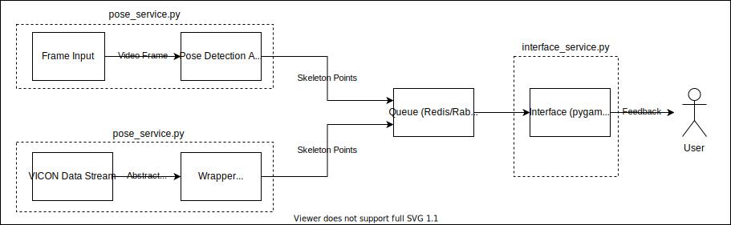

# Real Time Pose

Real Time Pose is a tool created by the wearable computing research group. Headed and advised by Dr. Jason Forsyth. The purpose of the tool is to provide a modular video feedback mechanism that can take a variety of input, process that input with a pose detection model, display the results of the model, and allow researchers to manipulate the displayed results for the purposes of feedback and direction.

In order to use the tool, first ensure that rabbitmq is running. On linux use the following command:
> `sudo systemctl status redis.service`

To see if Redis is running. If not, run:
> `sudo systemctl start redis.service`

To start the program, install the python dependancies listed in the `requirements.txt` file and run:

> `python main.py`

To start the real time pose GUI.

<!-- Next, start the user interface with `start_ui.py` and specify the desired activity. Once the first program is running, run `start_pose.py` with the desired input method. 

`start_pose.py` will fill up a queue with data points that will then be consumed by the front end.

### Example Usage:
> `python start_pose.py --help`

> `python start_ui.py --activity game` 
> `python start_pose.py video webcam` 

> `python start_ui.py --activity game_mk2 --file data/looped/jumping_jacks.csv --hide_demo` 
> `python start_pose.py video --hide_video file --path ./activities/jumping_jacks/demo.mp4`  -->

### Currently Working Activities:
* **game** - Two floating buttons that move around randomly.
<!-- * **game_mk2** - Actively moving buttons make user replicate dynamic motion. Complete with score tracking and name entering. (requires --file to define motion)
* **bread_crumb** - Buttons that move from one spot to another to guide a user into a defined motion. (requires --file to define motion)
* **haptic** - A single button moving around when clicked. Connects to the haptic golf glove to deliver feedback based on the button direction.
* **shapes** - Six triangles followed by six rectangles followed by six circles (requires --file to define motion(data/looped/shapes.csv)) -->
* **vector_haptic** - Pairs with haptic glove to deliver haptic feedback and direct a user to move their hand to randomly generated points.

## Project Layout
The project is laid out in seperate modules in an attempt to achieve the lowest amount of [coupling](https://en.wikipedia.org/wiki/Coupling_%28computer_programming%29) possible. Allowing frame inputs, pose detection algorithms, and frontends to be swapped seamlessly. This design choice was made in an effort to future-proof the tool in the event that new algorithms or approaches are released.

A basic flow of data can be seen below. 

### Modules

The following are main modules that comprise the project. Each can be found in a seperate folder in the project.

* pose_detection
* feedback
* ui
* data_logging
* activities
* utils
* constants
